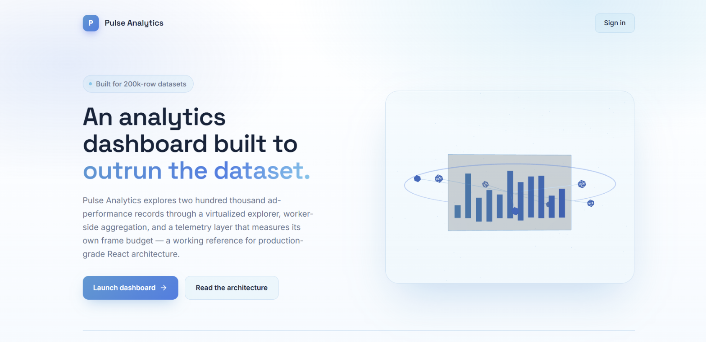
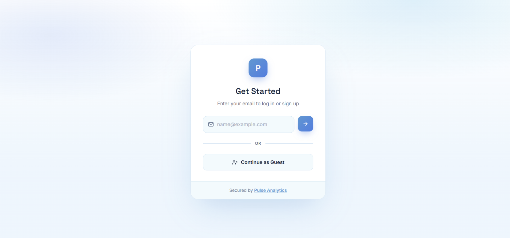
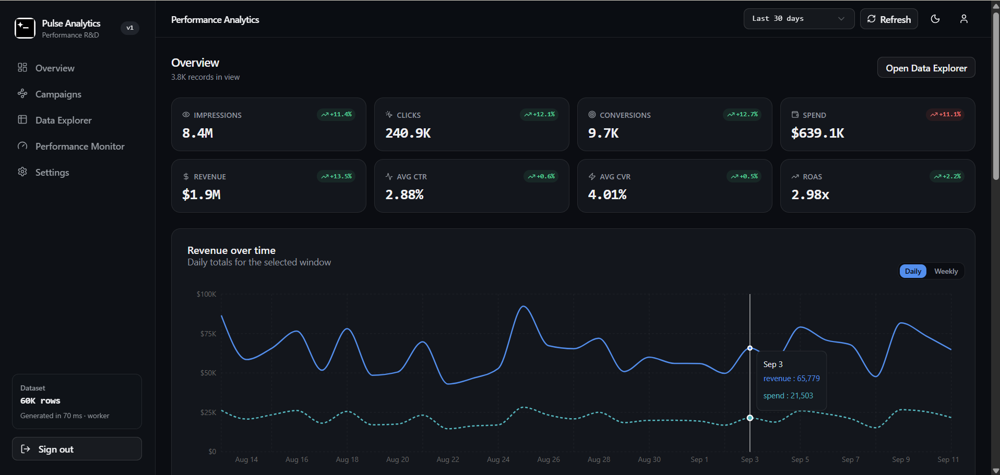
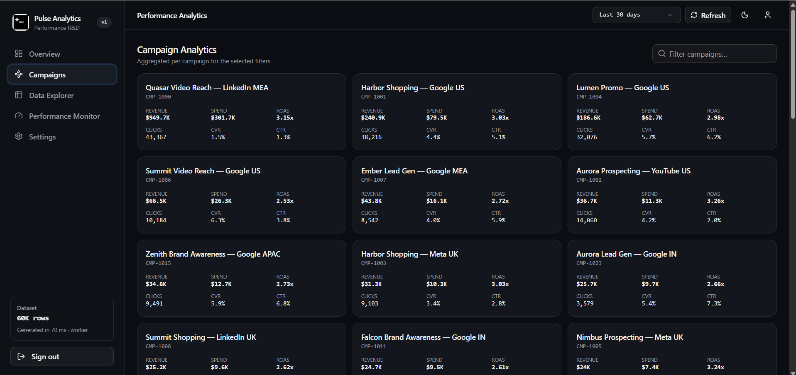
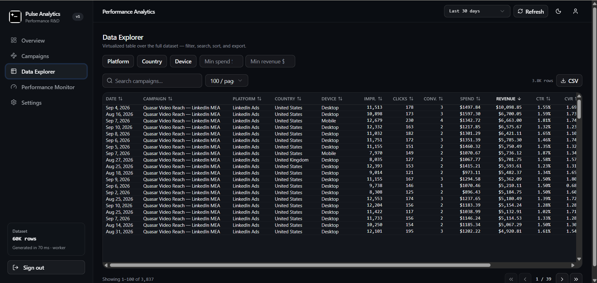
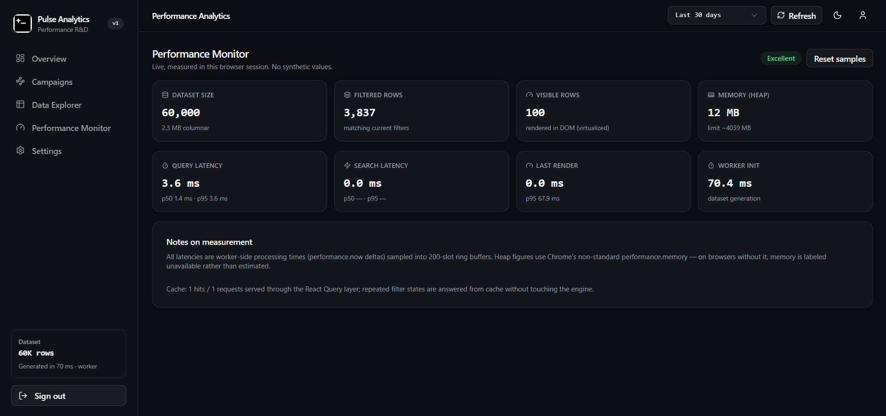

# Performance-Critical Data Visualization Dashboard

**Pulse Analytics** — a production-quality ad-performance analytics dashboard engineered around one constraint: **the browser must stay at 60fps while exploring hundreds of thousands of records.**

It is a frontend R&D project: every architectural decision — a Web Worker data engine, a columnar in-memory store, a virtualized table, and a live performance monitor — exists to demonstrate scalable data handling in React.

---

## Overview

| | |
|---|---|
| **Frontend** | React 19 · TypeScript (strict) · Vite · Tailwind CSS v4 · shadcn/ui |
| **State** | Zustand (filters/telemetry) · TanStack Query (async data layer) |
| **Data engine** | Web Worker · columnar typed arrays (`Int32Array`, `Float64Array`, …) |
| **Charts** | Recharts |
| **Table** | TanStack Virtual |
| **Auth** | Convex Auth (email OTP + guest sessions) |
| **Theme** | Light/dark, Modern design system (quiet neutrals, refined blue accent) |

### Pages

| Route | Page | What it demonstrates |
|---|---|---|
| `/` | Landing | Product overview, entry into auth flow |
| `/auth` | Auth | Email OTP + guest sign-in |
| `/dashboard` | **Overview** | 8 KPI cards with period deltas, 6 interactive charts |
| `/dashboard/explorer` | **Data Explorer** | Virtualized table over the full dataset: sort, search, filters, pagination, CSV export |
| `/dashboard/campaigns` | Campaign Analytics | Aggregated campaign cards, campaign drill-down |
| `/dashboard/campaigns/:id` | Campaign Details | Per-campaign KPIs + daily revenue/spend/conversions trend |
| `/dashboard/monitor` | **Performance Monitor** | Live measured latencies (p50/p95), heap, dataset stats, cache counters |
| `/dashboard/settings` | Settings | Rebuild dataset (10k–200k rows), theme toggle |

---

## Problem Statement

Typical dashboards fetch 50k+ rows as JSON, map them to JS objects, and render every table row into the DOM. Three things kill them:

1. **Parse/allocate cost** — converting 50k JSON rows to objects freezes the main thread for hundreds of ms.
2. **DOM explosion** — 50k `<tr>` nodes make every scroll a layout event.
3. **Re-render storms** — one filter change re-runs aggregation across all components.

Pulse Analytics eliminates all three by design.

---

## Architecture

```
User
 ↓
React 19 + TypeScript (pages, charts, virtualized table)
 ↓
TanStack Query  ←─ query keys embed the exact filter snapshot
 ↓
analytics client (promise-correlated postMessage, latency ring buffers)
 ↓
Web Worker — AnalyticsEngine
 ├─ generateDataset()  deterministic seeded synthetic data
 ├─ AnalyticsStore     columnar typed arrays + day-run index + filter cache
 └─ query/sort/page    search → sort → paginate, CSV serialization
 ↓
Zustand (filter store, telemetry stores)
```

### Data flow

1. On boot, the main thread sends `{ type: "init", rowCount }`.
2. The worker generates the dataset **entirely inside the worker** and replies with compact metadata (row count, campaigns, byte footprint).
3. Every view then sends a *query* — filters + search + sort + page — and receives **only the data it needs**:
   - KPI cards → one aggregated `Kpi` object
   - Charts → 8–545 aggregated points
   - Table → one page of ≤250 row objects
   - CSV → 5,000-row text chunks

**No raw dataset ever crosses the worker boundary.** The main thread never holds more than what is on screen.

### The columnar store

Records are stored as parallel typed arrays, not objects:

```
day:          Int32Array    campaign:  Uint16Array
country:      Uint8Array    device:    Uint8Array
impressions:  Float64Array  clicks:    Uint32Array
conversions:  Uint32Array   spend:     Float64Array
revenue:      Float64Array
```

~40 bytes per record, cache-friendly, zero per-row object headers. At 200k rows that is ~8 MB versus ~80+ MB as JS objects — and the arrays are allocated once.

Rows are reordered **day-ascending** with an O(n) counting sort after generation, so a date-window filter becomes a contiguous slice instead of a full scan. The store also keeps an **LRU filter cache** (keyed by the full filter state) so re-sorting, re-paging, or toggling between previously seen filter states skips the scan entirely.

---

## Performance Optimizations

### 1. Why virtualization was used

`@tanstack/react-virtual` renders only the ~20 rows inside the viewport (+8 overscan). For 200k filtered rows the DOM contains **~28 `<tr>` nodes**, regardless of dataset size. Scroll stays a compositor-driven transform instead of a layout event. Without it, the table alone would create 200k rows × 16 cells = 3.2M DOM nodes — impossible on any device.

### 2. Why server-side-style pagination was used

The engine's query API mirrors a server contract (`page`, `pageSize`, `sortBy`, `sortDir`, filters) and returns `{ data, pagination }`. Only one page of row *objects* is materialized per response — the sort runs on an index array, not on row objects, so `page 2` reuses the memoized sorted view with zero additional aggregation. The same protocol would work unchanged against a REST backend.

### 3. How debouncing reduces API calls

Search input is debounced (`useDebounce`, 250 ms) before it enters the filter store, so typing "linkedin" produces **one** engine query instead of eight. Keystrokes still update the input instantly because the raw value lives in local component state; only the settled value reaches the data layer.

### 4. How memoization reduces unnecessary computation

- `React.memo` on every chart, KPI card, and table row render path.
- `useMemo` for chart data mapping and query objects (stable references → stable query keys).
- Engine-level memoization: filter→index compilation and the sorted view are cached inside the worker; identical requests are answered in microseconds.
- Zustand selectors with `useShallow` so unrelated filter fields don't re-render subscribed components.

### 5. How React Query caching works

Every query key embeds the exact filter snapshot:

```
["analytics", "table", { startDay, endDay, platforms, …, search, sortBy, page }]
```

- Identical filter state → cache hit, zero engine work.
- `staleTime: 5 min` — aggregates are immutable per filter snapshot in this workload.
- `placeholderData: prev` keeps the previous chart on screen while new filters compute, so the UI never flashes empty.
- "Refresh" is an explicit `invalidateQueries`, matching how a real server-backed cache would work.

### 6. How code splitting improves initial load

Every route is a `lazy()` chunk. Recharts, framer-motion, and radix primitives live in separate vendor chunks (`vite.config.ts` `manualChunks`), so the entry bundle stays small; the chart library only downloads when a chart page loads.

### 7. How large datasets are handled

- **Worker isolation** — generation, filtering, sorting, aggregation, and CSV serialization never block the main thread.
- **Columnar layout** — 40 B/row, SIMD-friendly tight loops.
- **Day-run index** — date filters slice instead of scanning.
- **LRU filter cache** — repeated interactions are O(1).
- **Search on campaign table** — matching campaigns are precomputed per query, then rows are tested with an O(1) flag lookup.
- **Chunked CSV export** — 5k rows per worker message with `setTimeout(0)` yields between chunks; the UI paints throughout a 200k-row export.

### 8. How unnecessary re-renders are avoided

- Global filter state lives **outside React** (Zustand) with narrow per-field selectors.
- Query results are structurally shared by TanStack Query; memoized children don't re-render when identical data re-arrives.
- The table's `useEffect` writes telemetry to an imperative store (not React state), so the Performance Monitor can poll without triggering render cascades.
- Route-level and chart-level error boundaries isolate failures.

---

## Dataset

Deterministic, seeded synthetic data (`mulberry32` PRNG) — same seed, same data, every session:

- **42 campaigns** across 5 platforms (Google Ads, Meta Ads, LinkedIn Ads, YouTube, TikTok), zipf-weighted so a few campaigns dominate revenue
- **545 days** of history ending yesterday
- Realistic platform economics: LinkedIn CPC ≈ 5× TikTok CPC, video CTRs lower than search
- Weekly seasonality (weekend dip), per-campaign country/device biases, Gaussian noise on CPC/CVR/ROAS

Size is configurable in **Settings → Dataset** (10k – 200k rows). The default is 60k. Generation is timed and reported on the Performance Monitor.

---

## API Documentation

The client-side engine intentionally mirrors a REST contract, so swapping in a real backend is a data-layer change only.

### Worker protocol (current implementation)

| Request | Payload | Response |
|---|---|---|
| `init` | `rowCount` | `ready` + dataset meta |
| `query` | filters, `search`, `sortBy`, `sortDir`, `page`, `pageSize` | `{ rows, pagination }` |
| `summary` | filters | `{ kpi, deltaPct }` (incl. previous-period comparison) |
| `timeseries` | filters, `granularity: "day" \| "week"` | `TimeSeriesPoint[]` |
| `breakdown` | filters, `dimension: platform\|country\|device\|campaign`, `limit?` | `GroupTotals[]` |
| `campaign` | `campaignId`, filters | `{ totals, series }` |
| `csv` | query, `offset`, `limit` | `{ text, totalRows, done }` (streamed chunks) |
| `clearCache` | — | `ack` |

Every response carries `processingMs` and `cacheHit` for the Performance Monitor.

### Equivalent REST shape (for reference)

```
GET /api/analytics?startDate&endDate&platform&country&device&campaign
                  &search&sortBy&sortOrder&page&pageSize
GET /api/analytics/summary
GET /api/analytics/timeseries?granularity=day|week
GET /api/analytics/platforms | /countries | /devices | /campaigns
GET /api/health
```

Response envelope:

```json
{
  "data": [],
  "pagination": { "page": 1, "pageSize": 100, "total": 50000, "totalPages": 500 }
}
```

All parameters are validated and clamped (`pageSize ≤ 1000`, page ≥ 1, unknown values rejected) — the same validation belongs on a server.

---


## 📸 Screenshots

### Landing & Authentication

| Landing Page | Authentication |
|---|---|
|  |  |

### Analytics Dashboard



### Campaign Analytics



### Data Explorer



### Performance Monitor



## Local Setup & Running

This project uses a React/Vite frontend with Convex as the backend and authentication layer. When cloning the repository onto a new PC, follow the steps below.

### 1. Prerequisites

Install the following before starting:

* Node.js 18+ (Node.js 20+ recommended)
* npm
* Git
* A GitHub account with access to the repository
* Convex account

Verify the installation:

```bash
node --version
npm --version
git --version
```

---

### 2. Clone the Repository

Open Command Prompt or PowerShell and run:

```bash
git clone https://github.com/BharathReddyBgit/performance-analytics.git
```

Move into the project:

```bash
cd performance-analytics
```

---

### 3. Install Frontend Dependencies

Install all required packages:

```bash
npm install
```

This installs React, Vite, TypeScript, Convex, Framer Motion, Recharts, TanStack libraries, and other project dependencies.

---

### 4. Configure Convex

The application uses Convex for backend functions, database operations, and authentication.

Start the Convex development environment:

```bash
npx convex dev
```

If this is the first time running the project on the PC, Convex may ask you to log in:

```bash
npx convex login
```

Follow the browser authentication process.

Then run:

```bash
npx convex dev
```

Keep this terminal running.

You should see something similar to:

```text
Convex functions ready!

Development
https://xxxxx.convex.cloud
```

---

### 5. Generate Convex Files

If the generated Convex files are missing after cloning or pulling the repository, run:

```bash
npx convex codegen
```

This generates the files required by the frontend, including:

```text
src/convex/_generated/
├── api.d.ts
├── api.js
├── dataModel.d.ts
├── server.d.ts
└── server.js
```

If you see errors such as:

```text
Cannot find module './_generated/server'
```

or:

```text
Cannot find module '@/convex/_generated/api'
```

run:

```bash
npx convex codegen
```

and then rebuild the project.

---

### 6. Configure Convex Authentication

The project uses Convex Auth.

If authentication configuration is missing on a new Convex deployment, run:

```bash
npx @convex-dev/auth
```

Follow the setup prompts.

Convex Auth requires:

```text
SITE_URL
JWT_PRIVATE_KEY
JWKS
```

The authentication configuration must be available in the appropriate Convex deployment environment.

For local development, the site URL is normally:

```text
http://localhost:5173
```

---

### 7. Set Convex Environment Variables

If the project requires the authentication issuer, configure it using:

```bash
npx convex env set VLY_CONVEX_AUTH_ISSUER https://freebuff.com
```

For production:

```bash
npx convex env set VLY_CONVEX_AUTH_ISSUER https://freebuff.com --prod
```

To check the configured variables:

```bash
npx convex env list
```

For production:

```bash
npx convex env list --prod
```

> Do not commit private keys such as `JWT_PRIVATE_KEY` to GitHub.

---

### 8. Configure the Frontend Convex URL

The frontend needs the Convex deployment URL.

For local development, use the development deployment URL provided by:

```bash
npx convex dev
```

For a production deployment, use the production Convex URL.

Example:

```env
VITE_CONVEX_URL=https://your-deployment.convex.cloud
```

Do not expose private Convex authentication keys in frontend environment variables.

---

### 9. Run the Application

Open a **second terminal** while `npx convex dev` continues running.

From the project directory:

```bash
npm run dev
```

Vite will normally start the application at:

```text
http://localhost:5173
```

Open the URL in your browser.

### Terminal setup

You should have two terminals running during development:

**Terminal 1 — Convex backend**

```bash
cd performance-analytics
npx convex dev
```

**Terminal 2 — React/Vite frontend**

```bash
cd performance-analytics
npm run dev
```

The frontend communicates with the Convex backend while both processes are running.

---

### 10. Test the Application

After the application starts:

1. Open the Vite URL.
2. Open the landing page.
3. Click **Sign In**.
4. Test email OTP authentication.
5. Test guest authentication.
6. Open the dashboard.
7. Test the analytics charts.
8. Open Data Explorer.
9. Test search, sorting and filtering.
10. Check the Performance Monitor.
11. Verify that the Convex backend shows no errors.

---

### 11. Production Build Test

Before deploying, always test the production build locally:

```bash
npm run build
```

A successful build should finish with:

```text
✓ built
```

Then preview the production build:

```bash
npm run preview
```

Open the URL shown by Vite.

---

### 12. If Convex Generated Files Are Missing

After pulling the project from GitHub, you may encounter:

```text
Cannot find module './_generated/server'
```

or:

```text
Cannot find module '@/convex/_generated/api'
```

Fix:

```bash
npx convex codegen
```

Then:

```bash
npm run build
```

If the build succeeds, start the application again:

```bash
npm run dev
```

---

### 13. If `npm run build` Fails

First install dependencies again:

```bash
npm install
```

Then regenerate Convex bindings:

```bash
npx convex codegen
```

Then run:

```bash
npm run build
```

If the problem is related to stale dependencies, you can perform a clean installation on Windows:

```cmd
rmdir /s /q node_modules
del package-lock.json
npm install
npx convex codegen
npm run build
```

> Only remove `package-lock.json` if necessary. Prefer `npm ci` when a valid lockfile is already committed.

---

### 14. Common Issue: Convex and Frontend Must Both Run

A common mistake when setting up the project on a new PC is running only:

```bash
npm run dev
```

The frontend may start, but authentication or backend functionality can fail because Convex is not running locally.

For development, run both:

```bash
npx convex dev
```

and:

```bash
npm run dev
```

Think of the architecture as:

```text
Browser
   ↓
React + Vite
   ↓
Convex Client
   ↓
Convex Backend
   ↓
Database / Authentication
```

---

### 15. Git Pull Workflow

When the project is already installed and you want to get the latest changes:

```bash
git pull --rebase origin main
```

Then regenerate Convex bindings if required:

```bash
npx convex codegen
```

Install any new dependencies:

```bash
npm install
```

Finally:

```bash
npm run build
```

Then start development:

```bash
npx convex dev
```

In another terminal:

```bash
npm run dev
```

---

### 16. Recommended First-Time Setup — Quick Version

For a completely new PC:

```bash
git clone https://github.com/BharathReddyBgit/performance-analytics.git

cd performance-analytics

npm install

npx convex login

npx convex dev
```

Then open a second terminal:

```bash
cd performance-analytics

npx convex codegen

npm run build

npm run dev
```

Open:

```text
http://localhost:5173
```

---

### 17. Important Notes

* Do not commit `.env` files containing secrets.
* Do not commit `JWT_PRIVATE_KEY`.
* Convex generated files may need to be regenerated using `npx convex codegen`.
* Keep the Convex development process running while testing backend-dependent features.
* Run `npm run build` before submitting or deploying the project.
* Production uses a separate Convex deployment from local development.
* The Vercel deployment requires the production Convex URL to be configured correctly.
* If using Vercel SPA routing, keep the project's `vercel.json` configuration in the repository.

### Development Commands — Summary

| Purpose                  | Command                         |
| ------------------------ | ------------------------------- |
| Install dependencies     | `npm install`                   |
| Login to Convex          | `npx convex login`              |
| Start Convex             | `npx convex dev`                |
| Generate Convex bindings | `npx convex codegen`            |
| Start frontend           | `npm run dev`                   |
| Production build         | `npm run build`                 |
| Preview production build | `npm run preview`               |
| Pull latest code         | `git pull --rebase origin main` |
| Check Convex variables   | `npx convex env list`           |
| Deploy Convex production | `npx convex deploy`             |

### Typical Development Workflow

```text
Clone / Pull
     ↓
npm install
     ↓
npx convex codegen
     ↓
npx convex dev       ← Terminal 1
     ↓
npm run dev          ← Terminal 2
     ↓
Open localhost:5173
     ↓
Test Authentication
     ↓
Test Dashboard
     ↓
Test Data Explorer
     ↓
Test Performance Monitor
     ↓
npm run build
     ↓
Deploy
```


## Future Improvements

- **Real backend**: swap the worker transport for FastAPI + Postgres with the same API contract (the code is structured for exactly this swap).
- **Server-side aggregation pushdown** for datasets beyond ~1M rows.
- **IndexedDB persistence** so the dataset survives reloads without regeneration.
- **Unit tests** for the engine (aggregation sums, filter correctness, CSV round-trip) via `vitest` — the engine is pure and worker-isolated, which makes it directly testable.
- **Shared RSSW/SSR data loading** if a server is introduced.
- **Accessibility audit** to WCAG AAA contrast on chart series.

## Author

Built as a Frontend R&D assignment demonstrating performance-critical React engineering.
